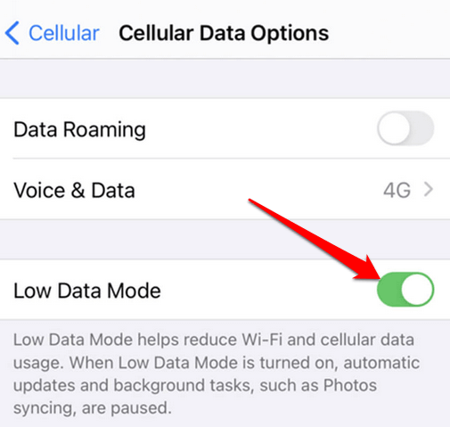

# Additional Settings

## Low Data Mode

To save cellular data and avoid additional fees we recommend enabling "Low Data Mode."

1. Go to Settings and tap Cellular or Mobile Data.
2. Tap your newly added SIM or E-SIM
3. Turn on Low Data Mode.

<figure><figcaption></figcaption></figure>
