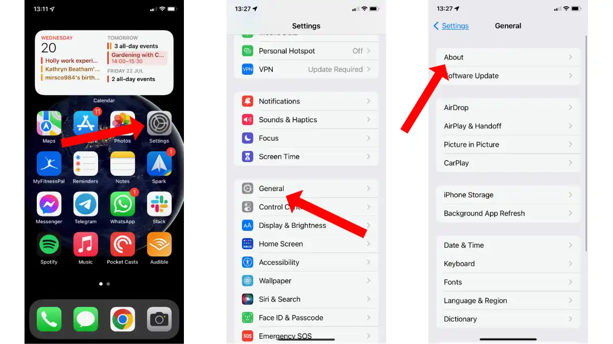
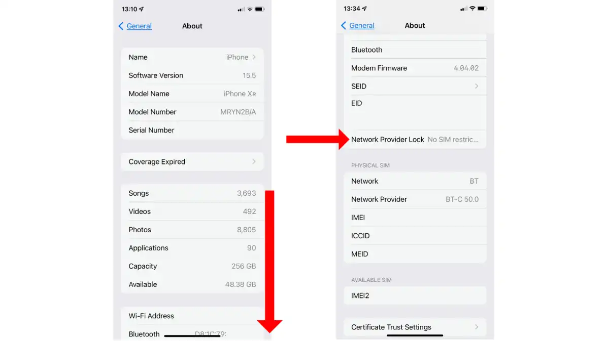

# Checking if you iPhone is Unlocked and Compatible

## 1. Open Settings > General > About 

<figure><figcaption></figcaption></figure>

## 2. Scroll down to find "Network Provider Lock"

<figure><figcaption></figcaption></figure>

If your device says "No SIM Restrictions" your device is Network Unlocked

## 4. Checking that your device is compatible

If your device is one of the following, you are compatible.

* iPhone 14
* iPhone 14 Plus
* iPhone 14 Pro
* iPhone 14 Pro Max
* iPhone 13
* iPhone 13 Mini
* iPhone 13 Pro
* iPhone 13 Pro Max
* iPhone 12
* iPhone 12 Mini
* iPhone 12 Pro
* iPhone 12 Pro Max
* iPhone 11
* iPhone 11 Pro
* iPhone 11 Pro Max
* iPhone XS
* iPhone XS Max
* iPhone XR
* iPhone SE (2020)
* iPhone SE (2022)
