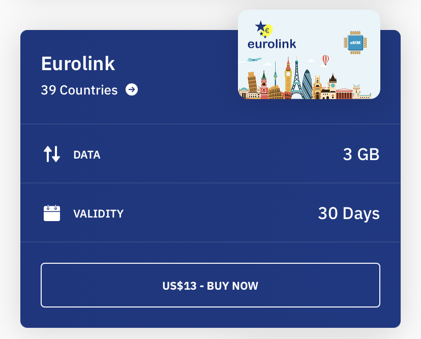
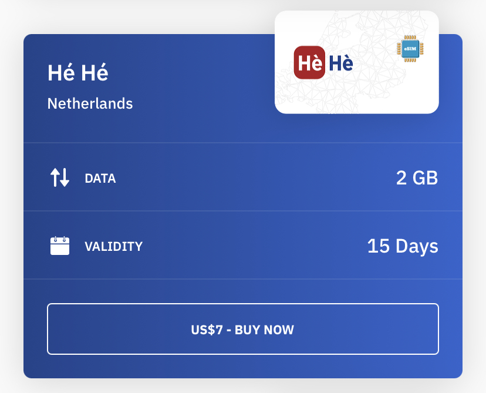

# Purchasing an E-SIM with Airalo

We recommend completing these steps on arrival at Amsterdam Schiphol Airport. These steps will require you to be connected to Amsterdam Airport's "[Airport\_Free\_Wifi](https://www.schiphol.nl/en/at-schiphol/services/wifi-at-schiphol)" network upon arrival.

## Recommended Data Packages

If you plan to remain traveling in Europe and outside of the Netherlands, we recommend selecting the EuroLink 30 day package.

<figure><figcaption>
Top up options are available to increase the amount of data available.
</figcaption></figure>

If you plan to only travel in the Netherlands, we recommend selecting the Hé Hé Netherlands 15 day package.

<figure><figcaption>
Top up options are available to increase the amount of data available.
</figcaption></figure>

## Setting up the E-SIM

Once you have selected your desired Data Package, watch the below video for installation instructions.



## [Additional Recommended Settings](../additional-settings.md)
